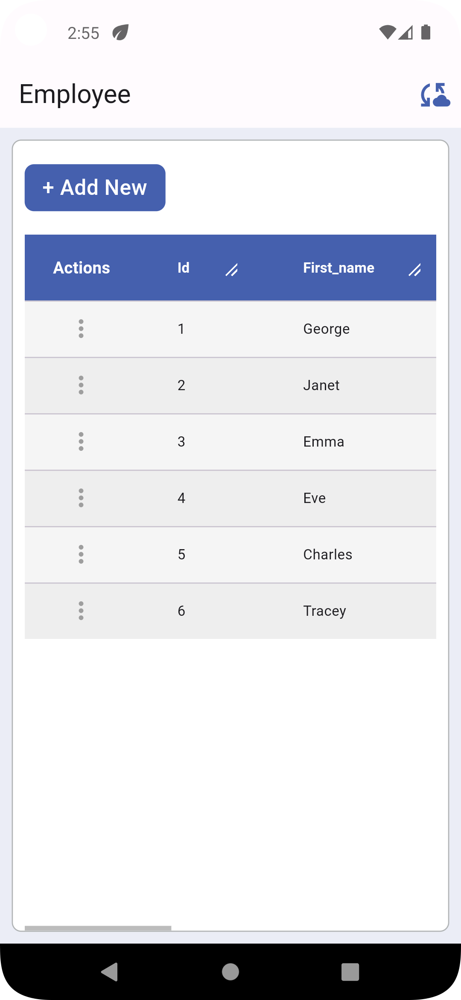
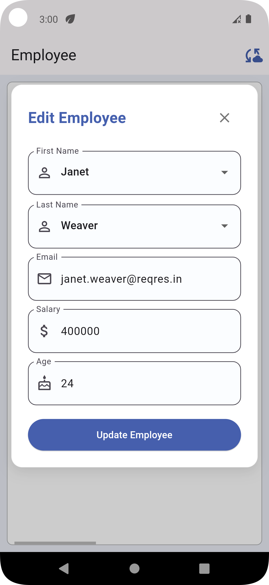
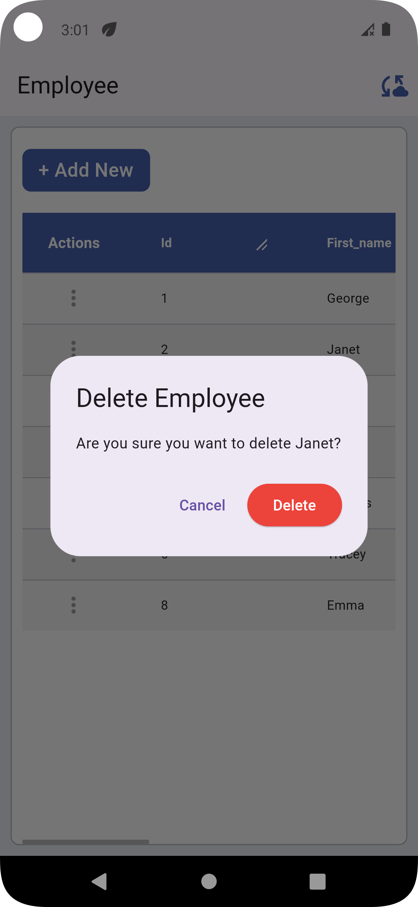
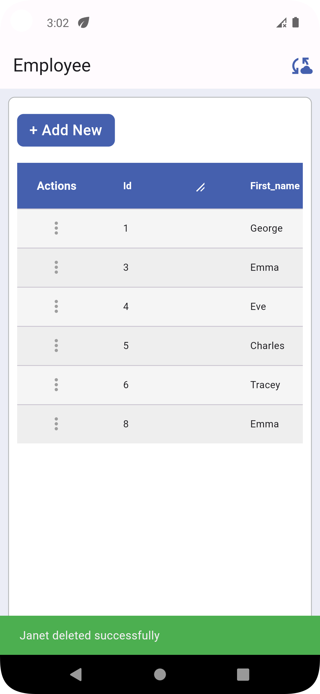
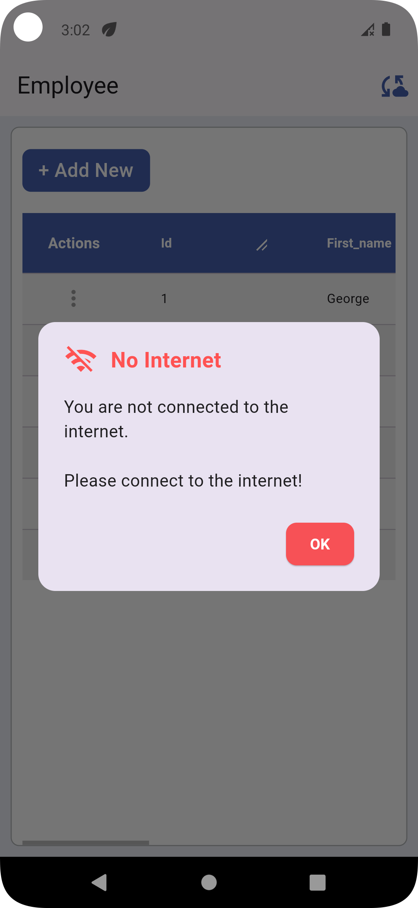
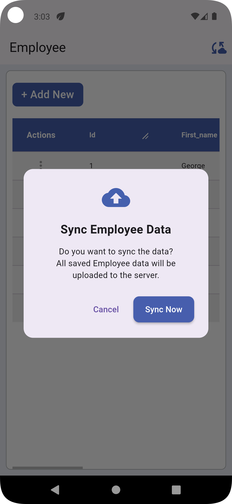
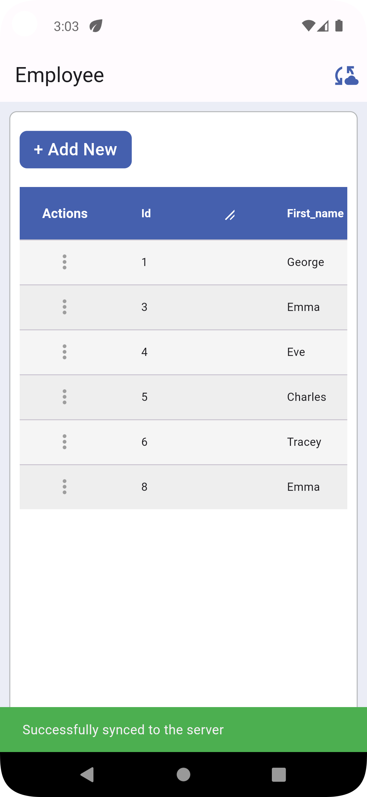
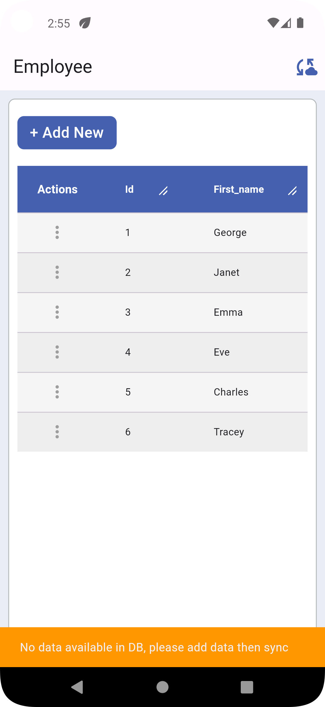

# Employee Management App [Offline]

A comprehensive Flutter application for managing employee data with full CRUD operations, offline support, and API synchronization. This app allows users to view, add, edit, and delete employee information through a clean and intuitive interface, with the ability to work offline and sync changes when connectivity is restored.

## Features

- **View Employees**: Display a list of all employees with their details in a sortable, filterable data table
- **Add Employee**: Create new employee records with validation
- **Edit Employee**: Update existing employee information
- **Delete Employee**: Remove employee records with confirmation
- **Offline Support**: Full functionality without internet connection
- **Data Synchronization**: Sync local changes with the server when online
- **Responsive UI**: Works on various screen sizes
- **RESTful API Integration**: Connects to a backend API for data persistence


## Installation

1. Clone the repository
   ```
   git clone <repository-url>
   ```

2. Navigate to the project directory
   ```
   cd employee_management_app
   ```

3. Install dependencies
   ```
   flutter pub get
   ```

4. Run the app
   ```
   flutter run
   ```

## Screenshots

| Employees Data | Add Employee | Successfully Add Employee | Edit Employee |
|:---:|:---:|:---:|:---:|
|  |  |  |  

| Successfully Update Employee | Delete Employee | Successfully Delete Employee | No internet connection |
|:---:|:---:|:---:|:---:|
|  |  |  |  |

| Sync All Db Data | Successfully Sync All Db Data | No Data Available Db |
|:---:|:---:|:---:|
|  |  |  |

## Architecture

The app follows a clean architecture pattern with separation of concerns:

- **Models**: Data structures representing business entities
- **Providers**: State management using Provider pattern
- **Services**: API communication and database operations
- **Screens**: UI components for different app views
- **Widgets**: Reusable UI components
- **Utils**: Helper functions and constants

### Local Database

The app uses SQLite (via sqflite) for local storage with the following features:

- Stores employee records locally
- Tracks pending operations for offline changes
- Maintains sync status for each record
- Handles conflict resolution during synchronization

### API Integration

The app connects to the ReqRes API for remote data operations:

- Fetches employee data from the server
- Sends local changes to the server when online
- Handles API errors gracefully
- Provides visual feedback during sync operations

## Project Structure

```
lib/
├── main.dart                  # Entry point
├── models/
│   └── employee.dart          # Employee data model
├── providers/
│   └── employee_provider.dart  # State management
├── screens/
│   ├── add_employee_screen.dart    # Add employee UI
│   ├── edit_employee_screen.dart   # Edit employee UI
│   └── home_screen.dart            # Main screen UI
├── services/
│   ├── api_service.dart        # API communication
│   └── database_helper.dart     # Local database operations
├── utils/
│   ├── app_pref.dart           # Local storage utilities
│   └── color_constant.dart     # Color definitions
└── widgets/
    ├── custom_button.dart      # Reusable button widget
    └── generic_data_table.dart # Reusable table widget
```

## Usage

1. **View Employees**: Launch the app to see the list of employees
2. **Add Employee**: Tap the "Add Employee" button and fill in the details
3. **Edit Employee**: Tap the edit icon next to an employee and modify their information
4. **Delete Employee**: Tap the delete icon next to an employee to remove them
5. **Sync Data**: Tap the cloud sync icon in the app bar to synchronize local changes with the server

## Dependencies

- **provider**: ^6.1.5 - State management
- **dio**: ^5.8.0+1 - HTTP client for API requests
- **http**: ^1.1.0 - HTTP requests
- **flutter_svg**: ^2.0.10+1 - SVG rendering
- **intl**: ^0.19.0 - Internationalization and formatting
- **shared_preferences**: ^2.2.3 - Local key-value storage
- **sqflite**: ^2.3.0 - SQLite database
- **path_provider**: ^2.1.1 - File system paths
- **connectivity_plus**: ^5.0.2 - Network connectivity detection